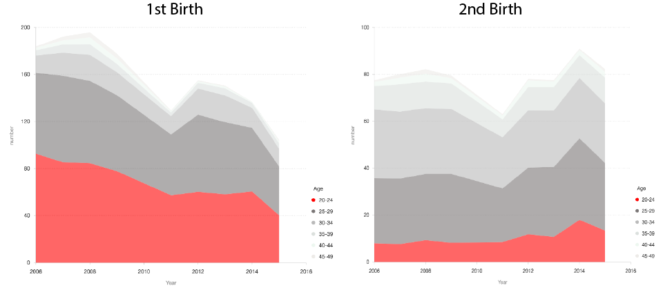

# How the One-Child Policy Changed China?

In October 2015, China decided to overturn its decades-old one-child policy and allow couples across the country to have two children. The one-child policy was introduced in 1979 when the government feared a rapid increase in population size after the baby boom of the 1950s and 1960s. 

China's One Child Policy most strictly applies to Han Chinese living in urban areas of the country. It does not apply to ethnic minorities throughout the country. Han Chinese represent more than 91% of the Chinese population. Just over 51% of China's population lives in urban areas. In rural areas, Han Chinese families can apply to have a second child if the first child is a girl.

### Population Control

Looking at just a half century of data on China, we can see peaks and valleys in the birthrate reflecting the one-child policy.

The recent peak total fertility rate for Chinese women was in the late 1960s, when it was 6.38 in 1966 and 1967. When the One Child Policy was first imposed, the total fertility rate of Chinese women was 2.94 in 1978. In 2012, the total fertility rate had dropped to 1.55 children per woman, well below the replacement value of 2.1 at which a population naturally replenishes itself from one generation to the next.

### The Changing Age

From 1960 through the 1980s, teenager or younger children constituted a larger percentage of China’s expanding population than any other age group. 
By 2050, above 60-year-olds will form the largest share.

### Unproductive Relaxed Rules Until Universal Policy

About 1.45 million couples had applied to have a second child under the relaxed rules announced in late 2013, but that was only about 12 percent of the number eligible, disappointing demographers and policy makers who had hoped the policy shift would do more to counteract the rapid aging of China’s population. There was a significant rise in births in Chinese hospitals in 2015, with 17.86 million recorded, an increase of 7.9 percent and the highest annual number since 2000.

### Late Baby Boom

Though the birth rate may be higher than it was a year ago, China has been below replacement rates for the past 20 years. 
