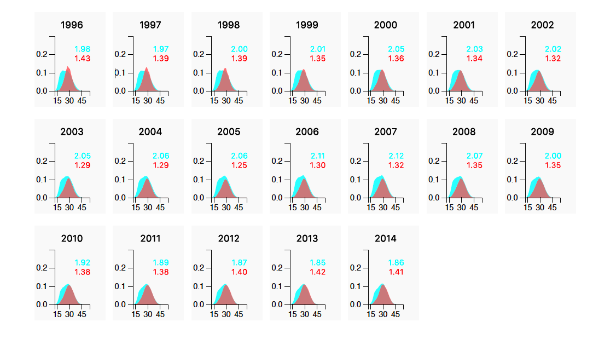

###  Fertility in Japan and US

Data is from <code>fertility.csv</code>

using D3 and small multiples. each year has its own graph, with Japan and USA area graphs on top of each other and the year as a note at the top. 

###  Middle Class Income

Data is from <code>middle-class-income.csv</code> and <code>middle-class-income-usa.csv</code>

Reproducing a graphic from <a href="https://www.nytimes.com/2014/04/23/upshot/the-american-middle-class-is-no-longer-the-worlds-richest.html?rref=upshot">this Upshot article</a>.
. 

