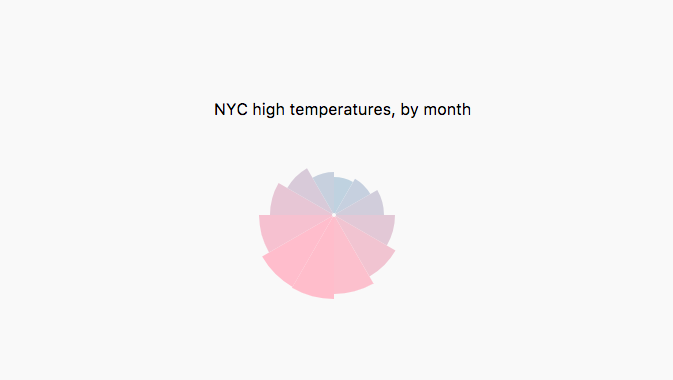
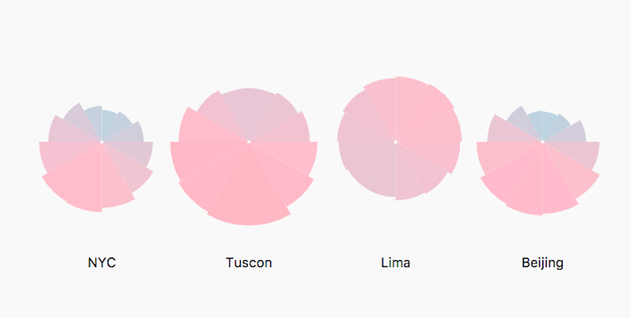
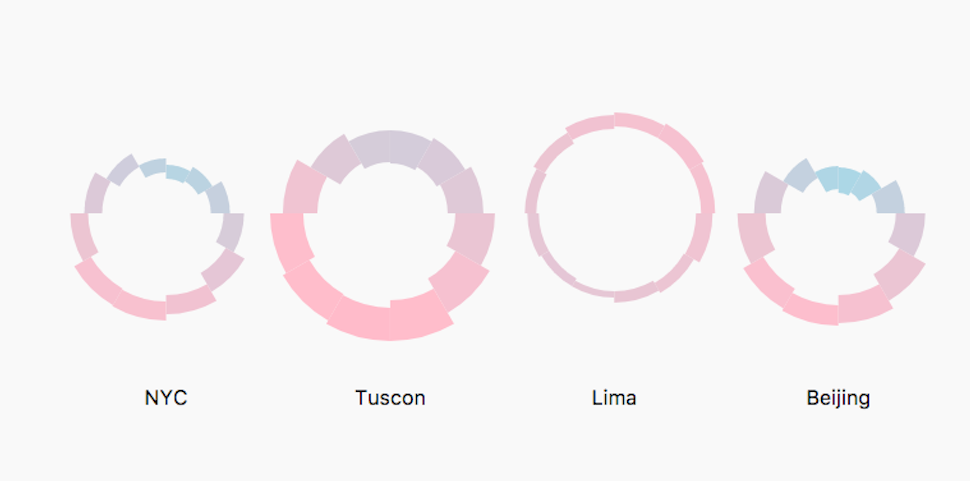
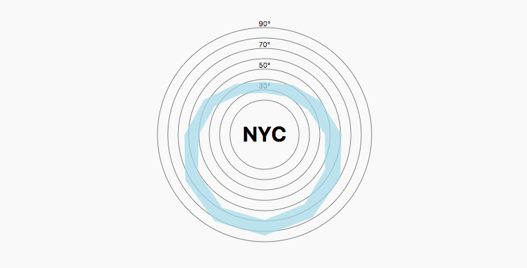
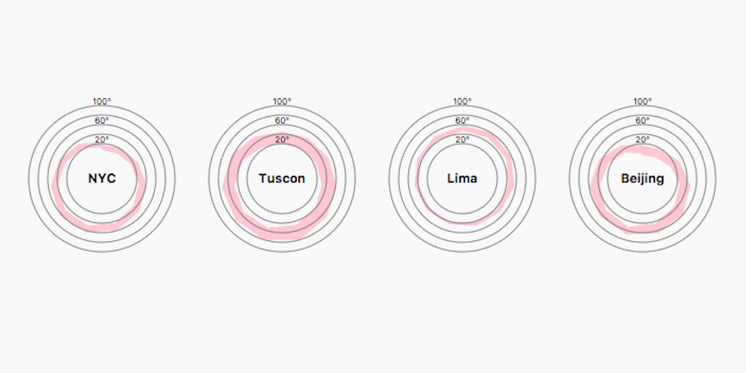

# D3: Radials and more small multiples

### Fixed-wedge size pie, or radial bar graph

Dataset is <code>data/ny-temps.csv</code>

### Small multiples

Dataset is <code>data/all-temps.csv</code>

### Showing the minimum temperature for each month

Dataset is <code>data/all-temps.csv</code>

### Radial area charts

Dataset is <code>data/ny-temps.csv</code>

### Radial area charts, small multiples

Dataset is <code>data/all-temps.csv</code>

