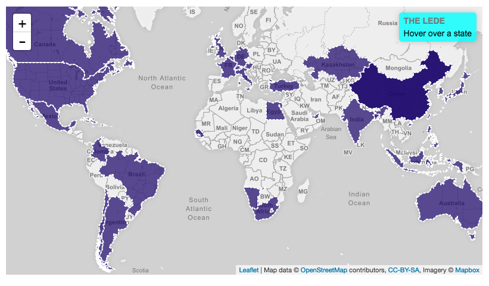
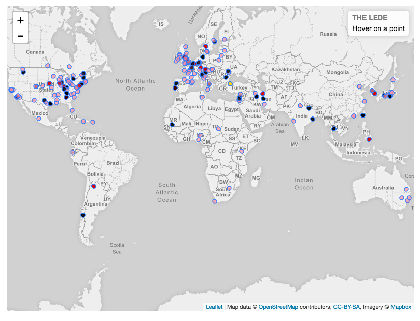

The critics who participated hail from 36 countries: 81 from the US, 19 from the UK, five each from Canada, Cuba, France, and Germany, and four each from Australia, Colombia, India, Israel and Italy. Lebanon, the UAE, China, Bangladesh, Chile, Namibia, Kazakhstan and many others are represented too. Of the 177 critics, 55 are women and 122 are men.

1.In the Mood for Love - 49 Votes

2.Mulholland Drive - 47 Votes

3.There Will Be Blood - 35 Votes

4.Spirited Away - 34 Votes

5.Boyhood - 30 Votes

Each point presents a director. Colors mean the numbers of films from each director which voted from critics.

1.Quentin Tarantino — 6 Movies

2.Clint Eastwood — 5 Movies

3.Nuri Bilge Ceylan — 5 Movies

4.Tsai Ming-liang — 5 Movies

5.Joel and Ethan Coen — 4 Movies

Data Souce: 

http://www.bbc.com/culture/story/20160819-the-21st-centurys-100-greatest-films-who-voted

http://www.imdb.com/
